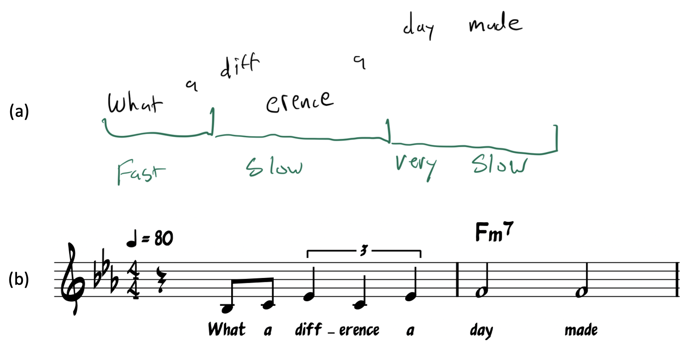

```{r, echo = FALSE}
rm(list = ls())

library(huxtable)
library(tidyverse)
library(knitr)
```

# The Parlance of Probability

Many profound scientific and intellectual advances trace their origins to advances in _notation_. It makes sense: as we develop ways to express specific concepts clearly and succinctly, our understanding of their interrelationships expands, as does our ability to combine these concepts in interesting---sometimes generative---ways. Consider a non-mathematical example. Figure \@ref(fig:music) shows two possible representations of the first two measures of the jazz standard, "What a Difference a Day Made" by Maria Grever.^[Grever, a Mexican composer, wrote the original melody. The tune was adapted to English by Stanley Adams.] Figure \@ref(fig:music)(a) shows how the tune might be represented in the absence of a formal system. The presentation conveys the gist, but is widely open to interpretation: no two musicians would play it the same way. Figure \@ref(fig:music)(b) represents the tune within the standard system for musical notation. Here, the notes and their durations are conveyed with precision, such that any trained musician could reproduce it almost exactly. Additionally, the standardization gives the musician the tools she would need to embellish her performance with outside knowledge. For instance, she could apply her hours of practice improvising over an F-minor seventh chord (represented in the second measure) to ornament the basic melody.

``` {r music, echo = F, out.width="80%", fig.cap = "Two representations of a jazz standard."}

```
The study of statistical uncertainty rests on what scholars have discovered about probability---a focus area that has a substantial ecosystem of notation. The notation developed to deal with a recurrent problem: that while it is easy to describe _specific events_ (we rolled a die, and it landed on the number 3), sound thinking about inference requires describing things at a higher level of generality (for any six-sided die, the probability of rolling each number is one out of six). This chapter presents an overview of the most foundational concepts and notational practices. [XX less example-driven?]

## Probability Axioms

The study of probability begins with what are called _axioms_. What is an axiom? We think of it as a statement that a person should accept as true, in service of facilitating a further discussion. The following statements might be considered axioms:

* Children are younger than adults.
* Life is suffering. (A tenet of Buddhism.)
* All people are created equal. (A spin on a famous statement in the American Declaration of Independence)

By offering these as examples of axioms, we do not mean to stipulate that each of these statements is definitely true in all circumstances whatsoever. We can imagine ways to challenge each of them. (For instance, perhaps my 80-year-old uncle behaves so immaturely that he _counts_ as a child.) Engaging in such hair-splitting is to miss the point. People label something as an axiom because they wish to avoid getting bogged down in whether the statement is true or not. Rather, axioms are useful because they can serve as a starting point to make subsequent deductions---sometimes ones that are far from obvious.

To get started, we'll need two definitions:

* An *event* is the result of some stochastic process. Here, "stochastic" is a near synonym for "random."^[Although the words are nearly perfect synonyms, people sometimes (wrongly) take the word "random" to connote that the probabilities of each event being described are _equal_. But this is not necessarily implied by the word "random."]

* *Sample space* is an exhaustive accounting of all the events that could have occurred at the end of a process, often described using set notation. For instance, the sample space for how a coin will land following a flip is {heads, tails}. The sample space for the result rolling a six-sided die is {1, 2, 3, 4, 5, 6}. The sample space for a game of rock-paper-scissors (from the standpoint of one of the players) is {win, lose, draw}.

The sample space for a particular event is commonly denoted with the capital Greek letter Omega: $\Omega$. Particular events can be denoted in many different ways, but it is common to employ some kind of context-appropriate shorthand that is explained to readers, as we will see in the examples to follow.

While our early example will focus on familiar processes where the mathematical properties are straightforward (coin flips, die rolls, and so on), it's worth stressing that, in social scientific contexts, almost anything can conceptualized as a stochastic process. For instance, we might conceptualize a country's governing system five years after election of an authoritarian leader as a process with the sample space {country slips into authoritarian governance, country returns to democratic governance}.

With that in mind, here are XX widely-accepted axioms that form a foundation for studying probability.

1. The probability of an event (denoted by $A$) happening is never negative.

$$
P(A) \geq 0.
$$

2. The probability of some event within the sample space ($\Omega$) happening is 1.

$$
P(\Omega)=1
$$
These two axioms tell us that probabilities range from zero to one. Zero will represent the idea that a particular event will definitely not happen. And one will represent the idea that an event definitely will happen. Because the whole purpose of a sample space is to be an exhaustive listing of all possible outcomes of a process, it follows that _some_ outcome in the space will happen. If it did not, it would mean that we conceptualized the sample space incorrectly. Notice that the formalism we are seeking requires these rules to be strict. In casual conversation, a person might express exuberant confidence by saying that the probability that their team will win a match is 110%. For our purposes, such a statement would be incoherent.

The next axiom requires an additional definition. We will say that two events are *mutually exclusive* if only one of them can occur. For instance, if the International Olympic Committee is choosing the continent for the next games, the outcomes "Choose North America" and "Choose South America" are mutually exclusive events, since the IOC cannot simultaneously choose both. This definition does not require that one of the mutually exclusive events be chosen. Continuing the example, the IOC could choose to hold the games in Africa, and this would do no damage to "Choose North America" and "Choose South America"'s standing as two mutually exclusive events.

Given this definition, we are ready for a third axiom, commonly known as the Addition Rule:

3. If events A and B are mutually exclusive, then

$$
P(A\:or\:B) = P(A) + P(B)
$$
Continuing our example from above, the Addition Rule says that, if the probability that the IOC chooses North America is 0.15 and the probability that it chooses South America is 0.25, the probability it chooses _one_ of the Americas is 0.40. Notice that, without mutual exclusivity, the Addition Rule falls apart. If the probability that the IOC chooses North America is 0.15, and the probability it chooses Los Angeles is 0.10, the probability that the IOC chooses North America or Los Angeles is _not_ 0.25.

Although axiom #3 hinges on mutual exclusivity, we can state a more general form of it that does not:

4. The probability of two events happening (mutually exclusive or not) is:

$$
P(A\:or\:B) = P(A)+P(B)-P(A\:and\:B)
$$
Notice first that, if $A$ and $B$ _are_ mutually exclusive, $P(A\:and\:B)=0$ by definition. The final term in the axiom goes away, and we are left with just the Addition Rule. If $A$ and $B$ are not mutually exclusive, then the $P(A\:and\:B)$ term corrects the "double counting" of probability that occurs when considering $P(A)$ and $P(B)$ alone. Continuing our Olympic example, to add $P(North\:America)=.15$ to $P(Los\:Angeles)=.10$ is to double count $P(Los\:Angeles)$, since Los Angeles is included in North America. We correct this by subtracting $P(A\:and\:B)=.10$, arriving at $P(A\:or\:B)=.15$. It makes sense that this probability is identical to $P(North\:America)=.15$: adding Los Angeles to the mix cannot increase $P(North\:America)$, since Los Angeles is included in North America. Things become a little more interesting when one event does not fully encompass the other, as we will see in the exercises.

Our fifth and final axiom requires one more definition. The *complement* of an event refers to all the parts of the sample space that do not include the event. For instance, if the event is "IOC chooses North or South America," the complement is choosing any place outside of North and South America.^[We're assuming that a choice will be made. If we did not make this assumption, then "No choice" would also be included in the complement.] The complement to an event $E$ is commonly denoted with a superscript C, as in $E^C$. 

Because $E$ and $E^C$ together carve up the entire sample space $\Omega$, we can use Axiom #2 to deduce that:

```{=tex}
\begin{align}
P(\Omega) = 1 \\
P(E) + P(E^C) = 1 \\
P(E^C) = 1 - P(E)
\end{align}
```

That is, if we know the probability of an event, we can determine the probability of its complement by subtracting the event's probability from 1. If the probability of the Olympics being held in North or South America is 0.40, then the probability of the Olympics being held elsewhere must be 0.60.

With this definition in hand, we are ready for the fifth axiom, commonly known as the Law of Total Probability.

5. For any events $A$ and $B$,

$$
P(A)=P(A\:and\:B)+P(A\:and\:B^C).
$$

One way to think about the Law of Total Probability is to see that it starts with an event ($A$) and carves up the probability within $A$ into mutually exclusive parts. For instance, the probability that the IOC will choose North America can be broken down into the probability that the IOC chooses Los Angeles [$P(A\:and\:B)$] and the probability that it chooses any place in North America other than Los Angeles [$P(A\:and\:B^C)$]. Since these two probabilities ("Los Angeles" or "Anywhere else in North America") are mutually exclusive and exhaustive, they must sum to the total probability associated with "North America."

> **Upshot**: Probabilities strictly range from zero to one, and their behavior derives from five axioms.

## Conditional Probability

So far, we have focused mostly on _marginal_ probabilities. Marginal probabilities, sometimes called unconditional probabilities, are probabilities that stand alone, unaffected by information about context. When a person refers to the probability that a Democrat will be elected president, that the economy will enter a recession within one year, or that a street protest will be met with violent suppression _without_ attending to other considerations that might make such events more or less likely (e.g. for the president example, that the Democratic Party has held the White House for eight years), they are talking about marginal probabilities.

It is also common to be interested in the probabilities that two distinct events $A$ and $B$ both occur, as well as how the probability of one event ($A$) would change depending on the knowledge that a separate event ($B$) occurred. The first concept---two events both occurring---is called _joint_ probability. The second concept---contemplating dependence among distinct events and how information about one influences predictions about another---is called _conditional probability_. 

``` {r wartable, echo = FALSE, }
wartable <- data.frame(
  Noborder = c(.90, .01, .91),
  Border = c(.07, .02, .09),
  Total = c(.97, .03, 1.0)
)

rownames(wartable) <- c("No war", "War", "Total")
colnames(wartable) <- c("No border", "War", "Total")

wartable <- kable(wartable,
                  booktabs = T,
                  caption = "Probability of War" )

wartable
```

Table \@ref(tab:wartable) makes these concepts more concrete. The table shows hypothetical probabilities that a pair of countries will engage in war (event $A$), depending on whether or not they share a border (event $B$). Each number in the `Total` columns and rows represents one marginal probability. For instance, the marginal probability that a pair of countries will engage in war is 0.03. Each of the numbers at the intersection of two possible events represents a joint probability. For instance, the joint probability of a pair of countries sharing a border and avoiding war is 0.07. 
How about conditional probability? Before we show how to calculate conditional probability, let us pause to re-introduce you to the bar operator $|$. We say "re-introduce" because we have already met this operator in a different context. As we saw in Section XX, when writing conditional statements in R, it is the "or" operator and is used to signify that a statement should evaluate to `TRUE` if either of its component parts are `TRUE`. When discussion probability, the same symbol (produced by the same keyboard stroke) means something entirely different.^[We sympathize with any confusion arising from this dual usage. Unfortunately we cannot reverse decades of momentum standing behind this pattern.] It is called the conditional operator, and it signifies that the probability of one event should be calculated assuming that some other event occurred. When speaking out loud, people usually express the symbol with the word, "given," conveying the idea that a condition following the $|$ operator should be assumed to be met.

Take the war example. We might express the probability that a pair of countries will go to war by writing $P(War)$. To focus on the probability of war between pairs of countries that share a border, we might write, $P(War|Shared\  border)$, where the broader context would convey that $Shared\ border$ is a condition that would be true for some pairs and not others. When speaking, we would refer to the "probability of war, given a shared border" or, for the other side of the conditional, $P(War|No shared border)$ and "the probability of war, given no shared border.

Conditional probability is a function of joint and marginal probability. In general,

```{=tex}
\begin{align}
P(A|B) = \frac{\mathrm{joint\ probability}}{\mathrm{marginal\ probability}} = \frac{P(A \mathrm{\ and\ } B)}{P(B)}
(\#eq:condprob)
\end{align}
```

That is, to calculate the probability of $A$ given $B$, we first calculate the probability of $A$ and $B$ co-occurring, and then divide by the marginal probability of $B$ alone. Continuing the war example, the probability of war given that countries share a land border is:
$$
\frac{P(\mathrm{Border\ and\ War})}{P(\mathrm{Border})} = \frac{.02}{.09} \approx 0.22
$$
This results makes sense. If we knew we were considering a pair of countries that share a border, we would have no reason to look at the `No border` column. We would focus exclusively on the probability concentrated in the `Border` column. And although war is not generally a likely event, it is much more likely within that column: the figures imply it is to be expected about 22% of the time. If this thinking seems disorienting in the present context, consider that it is a formal application of everyday common sense. Most chicken salad sandwiches ordered in a restaurant are fine to eat. But if your sandwich arrived with a dirty fork, you might be wary to eat it, since the probability of the sandwich being fine ($A$) is much lower when made conditional on being served in a restaurant that doesn't properly clean its forks ($B$).

> **Upshot**: Conditional probability is the set of mathematical tools used to update the probability of some event given that some other event has occurred. It is calculated as a function of joint and marginal probabilities.

## Statistical independence  {#independence}

Closely related to the idea of conditional probability is the idea of statistical independence. But, statistical independence is important enough to merit its own section. It is the idea that the probability of some event ($A$) is _not_ conditional on a separate event ($B$), and vice versa. That is, the probability of $A$ does not change at all once we learn the status of ($B$), nor does $P(B)$ change when we learn about A. More formally,

```{=tex}
\begin{align}
P(A|B) = P(A) \mathrm{\ and\ } P(B|A) = P(B).
(\#eq:independence)
\end{align}
```

When we combine this definition with the definition of conditional probability (Equation \@ref(eq:condprob)), we uncover a useful property, which is that if and only if two events are independent, then,

```{=tex}
\begin{align}
P(A\ \mathrm{and}\ B)=P(A)P(B).
(\#eq:independence2)
\end{align}
```

That is, if and only if two events are statistically independent, then their _joint_ probability is equal to the products of their marginal probabilities. (See the chapter appendix for a derivation.) (Equation \@ref(eq:independence2) is actually the more broadly accepted formal definition of statistical independence than Equation \@ref(eq:independence). But, we find Equation \@ref(eq:independence) more intuitive, so introduce it first.) This alternative statement of the definition of statistical independence can be useful, and it is not too hard to connect it to our sensibilities about the work. It might be a familiar fact that the probability that two successive coin flips both landing on heads is $0.5 * 0.5 = 0.25$. This works because coin flips are statistically independent. But, joint probabilities are _not_ always the product of the underlying marginal probabilities. Suppose that 50% of people have attended college, and that people read Descartes if and only if they attend college. In this circumstance, the probability that a randomly chosen person is someone who has attended college and who has read Descartes is _not_ $0.25$; it is $0.5$---because the two events are not statistically independent.

Statistical independence is commonly denoted with the $\perp$ symbol: $A\perp B$ signifies that variable $A$ is independent of $B$. This symbol is a natural fit, since it features lines that intersect at a right angle which, as we shall see, is a spatial representation of the idea of statistical independence.

In everyday life, we would commonly think of two successive coin flips or die rolls as independent events, since the outcome of the first tells us nothing about the outcome of the second (and vice-versa). Though a superstitious person might deny it, if the first flip lands on heads, it does not make it any more or less likely that the second flip will land on heads. 

Why is statistical independence so important? As you have already seen via the section on causality (Section XX), finding clean comparisons can be an extremely difficult task. It is one of the hallmarks, if not _the_ hallmark inferential challenge in the social sciences. It is so challenging to find clean comparisons because the outcomes we are interested in (e.g. a pair of countries going to war) typically have _many_ antecedents, and it is often too daunting to examine more than a handful of them at a time: in trying to understand the role of a shared land border as an antecedent to war, it would be daunting also to account for the contribution of cultural overlap, common language, leaders' personalities, participation in international alliances, trade relationships, governance structure, and the myriad other things that likely influence the probability of war. But we don't need to: in circumstances like this, it is often the case that some antecedents, although they are genuine, are nonetheless ignorable, since attending to them has no particular ramifications for the question at hand. The concept of statistical independence helps us be concrete and objective in deciding which factors need to be accounted for, and which do not.

Generally, data analysts think of statistical independence as a good thing. When two variables are independent of each other, one of them can often be ignored, which simplifies analytical steps considerably. Indeed, one way to think about the enterprise of randomized experiments (Section XX) is as a strategy for _making_ some variable(s) of interest become statistically independent from all other variables that might influence an outcome: random assignment is an independence machine. Of course, random assignment is not always feasible, so we need terminology and notation to contend with the circumstances where it is not.

> **Upshot**: Statistical independenence, often denoted by $\perp$, is the idea that knowing the outcome of one event reveals no information about the probability of a second event. Statistical independence often makes it easier to devise sound comparisons.

## Activities

1. The ANES dataset includes a variable (`age`) showing each respondent's age. Using this dataset, first create a factor variable that classifies respondents into five broad age ranges: 18-29 years old, 30-39, 40-49, 50-59, and 60+. In a simple table, report the marginal probability of a respondent belonging to each of these broad categories. Then, create a similar simple table showing the marginal probability of the respondent belonging to each of the 9 religious categories included in the `religion` variable.

``` {r Q1, echo = F, eval = F}
df <- read_csv("datasets/2020anes.csv")
df$agebin <- cut(df$age, breaks = c(17,29,39,49,59,99))

prop.table(table(df$agebin))
prop.table(table(df$religion))

Q1 <- kable(
  round(prop.table(table(df$agebin, df$religion)),4),
  booktabs = T)

Q1
```

2. Now, create a table showing the _joint_ probability of an ANES respondent belonging to every age X religion combination. Since there are 5 age categories and 9 religion categories, this table should have 5 rows and 9 columns. 

3. Calculate each of the following conditional probabilities:

a. The probability that they are not religious, given they are 60 or older.
b. The probability that they are not religious, given that they are under 30.
c. The probability that they are over 60 years old, given that they are Evangelical Protestant.
d. The probability that they under 30, given that they are Evangelical Protestant.

4. For reasons we will explore in future modules, _exact_ statistical independence (joint probabilities exactly equal to the product of marginal probabilities) almost never occurs in real datasets. Nevertheless, relationships can be closer or farther away from strict independence. With this in mind, evaluate which religion is closest to being statistically independent of age. Write a paragraph explaining your reasoning.

5. Suppose the probability that the Democratic Party nominates a woman as its presidential candidate is 0.45. And suppose that the probability the Party nominates a former governor is 0.60. And finally, suppose the probability that the Party nominates a woman _given_ that they have nominated a governor is 0.65. Use the definitions and axioms in the chapter to calculate:

a. The probability that the Party nominates a woman who is a former governor (i.e. the joint probability).

``` {r, eval = F, echo = F}
if (FALSE){
Governor	Woman		
	No	Yes	Total
No	0.2425	0.1575	0.4
Yes	0.3075	0.2925	0.6
Total	0.55	0.45	}

# Conditional = Joint / Marginal
# 0.65 = Joint / 0.60
# Joint = .65*.6 = .2925
```

b. The probability that the Party nominates a woman _or_ a former governor.

``` {r, eval = F, echo = F}
# P(A) + P(B) - P(A and B)
.45 + .6 - .2925
```

c. The probability that the Party nominates a governor, given that they have nominated a woman.

``` {r, eval = F, echo = F}
.2925 / .45
```
d. The probability that they nominate a governor, given that they have _not_ nominated a woman.

``` {r, eval = F, echo = F}
.3075 / .55
```

## Appendix

### Derivation of Equation \@ref(eq:independence2)

Begin with the definition of conditional probability:

```{=tex}
\begin{align}
P(A|B) = \frac{P(A \mathrm{\ and\ } B)}{P(B)}
\end{align}
```

Multiply both sides by $P(B)$ to get

```{=tex}
\begin{align}
P(A|B)P(B) = P(A \mathrm{\ and\ } B)
\end{align}
```

But from Equation \@ref(eq:independence), under independence, $P(A|B)$ simplifies to $P(A)$. Therefore,

```{=tex}
\begin{align}
P(A)P(B) = P(A \mathrm{\ and\ } B)
\end{align}
```
_QED._
