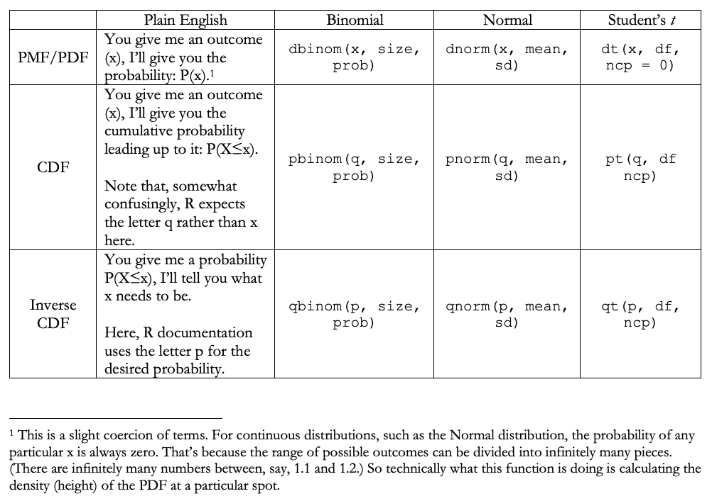
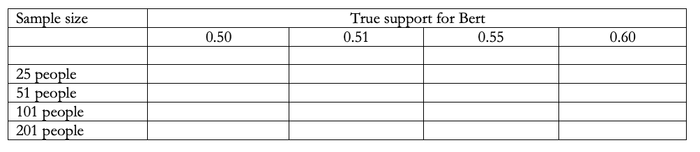

```{r, echo = FALSE}
rm(list = ls())

library(huxtable)
library(tidyverse)
library(knitr)
library(ggplot2)
library(directlabels)
library(ggpubr)
```

# Random variables and distributions {#distributions}

In chapter \@ref(simandprob), we used a simulation to have R create a probability distribution associated with a probabilistic event. While simulations can be illuminating, we cannot rely on them exclusively. For one thing, as we saw, they inherently lack precision, generating an approximate result even though an exact result might be available. Additionally, conducting a simulation would often involve writing a whole new algorithm tailored to a particular analytical situation, even though all the important aspects of the situation are extremely common and well-understood---something of a waste of time. This chapter goes into further detail about probability distributions---the mathematical tools that are used to describe them, as well as several distributions that, because they arise in a wide array of analytical situations, are especially important to learn.

## Notation for random variables

Let us begin by modestly embellishing the notation we have been using. Starting in chapter \@ref(parlanceprob), we casually referred to specific events, such as $P(\mathrm{Los\ Angeles})$ for the idea that the International Olympic Committee chose Los Angeles as the venue for its games. A more developed version of this notation makes a sharper distinction between a _random variable_ and the specific value that is realized in some instance. For instance, we might refer to the probability that a random variable called $X$ has taken on a specific value, such as 50, with the expression $P(X=50)$. We can also refer to the generic idea that a random variable such as $X$ has taken on _some_ specific value---even without specifying what the value actually is. In so doing, it is conventional to use a capital letter to refer to the random variable and a lower-case letter to refer to the specific realization. For instance, the expression $P(X=x)$ refers to the idea that a random variable ($X$) has taken on the specific value ($x$). This notion might seem overly abstract, but it turns out to be quite useful for specifying general formulas.

It bears notice that, in the paragraph above, the word _random_ carries a different connotation than it has in the past. Previously, "random" was reserved to refer to processes that were known to be independent of others (such as flipping a coin). Confusingly, in the current context, "random" does not necessarily imply the variable $X$ is independent of other variables. Rather, it merely captures the idea that $X$ will take on some value that cannot be known in advance. In our Olympic example, the actions of the IOC are emphatically not random in the "independent" sense of the word. But it would be normal to describe their choice as a random variable, at least if we were thinking of it as an event leading to a a specific outcome that will be revealed. We wish that this terminological muddle did not exist, but alas there is little we can do about it!

## Distribution functions {#pmfpdf}

In section \@ref(warsim), we used a simulation to consider how much time might pass before the onset of war. The result of that exercise was Figure \@ref(fig:warsimplot), which was a simulation-generated approximation of a probability distribution. A _probability distribution_ is an precise description of the relative likelihood of all possible outcomes following a random event. The word "precise" is important here. While we can generate approximations of a probability distribution via simulation (Figure \@ref(fig:warsimplot)), these are not precise enough for our present purposes.

Instead, probability distributions are described via functions. The most important class of function has a different name, depending on whether the event we are considering leads to a discrete outcome---one where there is a limited number of values that the outcome might take, such as (die rolls, coin flips, vote counts, advertisements aired)---versus a continuous outcome that can take on a infinite different values (e.g. temperature, voter turnout rates, government spending as a percentage of GDP). For continuous variables, such functions are called _Probability Density Functions (PDFs)_. For discrete variables, such functions are called _Probability Mass Functions (PMFs)_ or, occasionally, *discrete* Probability Density Functions.^[The distinction between PMFs and PDFs is a bit esoteric and commonly forgotten. In our experience, many people default to PDF irrespective of whether they are dealing with a discrete or continuous variable. Confusion seldom ensues.]

PMFs and PDFs are the main tool for describing a probability distribution. Here is how they work. Think about one possible outcome to a probabilistic event, such as rolling a fair die and having it land on the number 4. Think of that outcome as $x$. The PMF is the function that, provided an $x$, returns the probability of that event. It is standard to denote the PMF as $f(x)$ with a _small_ $f$. Thus, to apply the PMF for a fair die to the outcome that the die lands on 4, we would write $f(4)=P(X=4)=\frac{1}{6}$ The PDF works analogously, though the continuous case requires slightly different terminology, as we'll discuss below.

There are two other important distribution functions. For these functions, the terminology stays the same, irrespective of whether we are handling a discrete or continuous variable. Presented with an outcome $x$, the _cumulative density function (CDF)_ returns $P(X\leq x)$---the probability associated with the outcome $x$ or any lower value. It is standard to designate the CDF as $F(x)$ with a _capital_ $F$. The CDF can always be derived from the PMF (or PDF). In the discrete case, $F(x)=P(X\leq x)=\sum_{k\leq x}f(x).$ In plain language, to determine $P(X\leq x)$, we use the PMF to calculate probability associated with all $x$s less than or equal to $x$, and we sum them together. Thus, for $x=4$ in the die case, we would write:

```{=tex}
\begin{align}
F(4) &= P(x\leq 4) \\
& = f(1) + f(2) + f(3) + f(4) \\
& = \frac{1}{6} + \frac{1}{6} + \frac{1}{6} + \frac{1}{6} \\
& = \frac{4}{6} \\
& = \frac{2}{3}.
\end{align}
```

Finally, the _inverse CDF_, designated as $F^{-1}(x)$, works like the CDF in reverse: presented with a probability, the inverse CDF describes how high $x$ needs to be, for outcomes $x$ and below to be associated with that probability. For a fair die, $F^ {-1}(.75)=5$. This is because $P(x\leq 4)\approx 0.66$, but $P(x\leq 5)\approx 0.83$. So, $x=5$ is the smallest outcome $x$ associated with a probability of at least 0.75.

Even if this is all a bit abstract, let us turn now to specific events and their associated distributions, as doing so can help make the distribution functions more concrete.

## The Bernoulli Distribution {#bernoulli}

The Bernoulli Distribution, named after the Swiss mathematician Jacob Bernoulli, is the simplest probability distribution in common use. It is used to describe any random event (often called a Bernoulli trial) that has exactly two possible outcomes. Coin flips are the canonical example of a Bernoulli trial, but the Bernoulli Distribution does not require the two outcomes to be equally likely, as in a coin flip. The war example in section \@ref(warsim) was a series of Bernoulli trials (one for each year). The outcome of a U.S. presidential election by the incumbent party versus not can be thought of as a Bernoulli trial. A country's GDP going up versus down in a given year can be thought of as a Bernoulli trial (assuming away the possibility that GDP stays exactly the same). 

In Bernoulli trials, it is standard to label one outcome a "success" and to designate it with the number 1. The other event is a "failure" and is designated with the number 0. This labeling does not necessarily imply that one outcome is preferable to the other. It is just a terminological convenience. The probability of a success in a Bernoulli trial is labeled with the parameter $p$.

Bernoulli trials have a simple PMF. It is described by cases, meaning we exhaustively list all possible outcomes $x$, along with the probability of each. Because Bernoulli trials only have two outcomes, this is easy to do. The Bernoulli PMF is:

```{=tex}
\begin{align}
f(x)=\begin{cases}
p & \mathrm{if\ }x=1\\
1-p & \mathrm{if\ }x=0\\
0 & \mathrm{otherwise.}
\end{cases}
\end{align}
```

The PMF borders on merely describing the attributes of the trial in different terms. Suppose, for instance, that a soccer game has a $\frac{1}{3}$ probability of ending in a draw (defined here as a "success"). Thus, $p=\frac{1}{3}$. The PMF tells us that the probability of a success ($f(1)$) is $p$ itself, so $\frac{1}{3}$. It also tells us that the probability of a failure ($f(0)$---i.e. not a draw) is $1-p=\frac{2}{3}$. And the probability of any other outcome is 0. This description might seem repetitive, but we are trying to accentuate how the PMF works like a machine, taking a value of $x$ and returning the appropriate probability ($f(x)$).

As is always the case, the CDF can be deduced from the PMF. The CDF for a Bernoulli distribution also proceeds via cases. It is:

```{=tex}
\begin{align}
F(x)=\begin{cases}
0 & \mathrm{if\ }x<0\\
1-p & \mathrm{if\ }0\leq x<1\\
1 & \mathrm{if\ }x\geq1.\\
\end{cases}
\end{align}
```

In plain language, the cumulative probability the $x<0$ is 0. (Such outcomes are not possible for Bernoulli trials.) The probability associated with $0\leq x < 1$ is $1-p$, since this cumulative probability now includes the possibility of a failure. And highlighting the difference between a PMF and a CDF, the cumulative probability of $x\geq 1$ is 1. This last case includes both the probability of a failure _and_ a success---the only possible outcomes---and so it includes the entire sample space.

``` {r bernoullicdf, echo = F, warning = F, fig.cap = "CDF for a Bernoulli trial with p=1/3."}
# Note: Plot produced with the assistance of GPT-4.

# Set the probability of success
p <- (1/3)

# Create a data frame for the horizontal line segments
segments_data <- data.frame(
  x_start = c(-0.5, 0, 1),
  x_end = c(0, 1, 1.5),
  y = c(0, p, 1)
)

# Create the ggplot
p <- ggplot() +
  geom_segment(data = segments_data, aes(x = x_start, y = y, xend = x_end, yend = y), size = 1) +
  geom_point(data = data.frame(x_values = c(0,1), cdf_values = c(0,p)), aes(x = x_values, y = cdf_values), shape = 1, size = 4, color = "black") +  # Open circle
  geom_point(data = data.frame(x_values = c(0,1), cdf_values = c(p,1)), aes(x = x_values, y = cdf_values), shape = 19, size = 4, color = "black") +  # Closed circle
  labs(title = "", x = "x", y = "F(x)") +
  xlim(-0.5, 1.5) + ylim(0, 1)

p <- p + theme_bw()

# Print the plot
p
```

Figure \@ref(fig:bernoullicdf) is a plot of the CDF for a Bernoulli trial with $p=\frac{1}{3}$. Open circles represent an open set (no probability associated with the point) and closed circles represent a closed set (probability _is_ associated with the point). As you can see, cumulative probability increases in stepwise fashion, jumping from 0 to $p$ at $x=0$, and again from $p$ to 1 at $x=1.0$.

We will leave exposition of the Bernoulli inverse CDF as an exercise for the reader.

## The Binomial Distribution {#binomdist}

The Bernoulli Distribution is a key starting point, but it is rather boring. Things get more interesting and useful when we shift to the Binomial Distribution.

The Binomial Distribution is a generalization of the Bernoulli Distribution. Where the Bernoulli distribution describes a single binary trial, the Binomial Distribution describes a series of $n$ independent trials. Its outcome is the total number of successes across all trials. As such, although the individual trials are binary, the focal outcome in a Binomial distribution is the total number of successes across all trials. It ranges from 0 (no successes) to $n$---the number of trials being conducted. The total number of "heads" outcomes in a series of coin flips is the canonical example where the Binomial Distribution would apply. But we could also use the Binomial Distribution to think about the probability that a motion will be adopted by a committee (given a series of yes/no votes) or, as we experienced in \@ref(warsim), the likely delay before an event like war.

Where the Bernoulli Distribution had only one parameter ($p$), the Binomial Distribution has two: $p$, which represents the probability of success in an individual trial and $n$, which represents the number of trials. Its PMF is:

```{=tex}
\begin{align}
f(x) = \binom{n}{x}p^{x}(1-p)^{n-x}.
\end{align}
```

Here, $\binom{n}{x}$ is called the "binomial coefficient." It is shorthand for a more elaborate expression:

```{=tex}
\begin{align}
\binom{n}{k} = \frac{n!}{k!(n-k)!}.
\end{align}
```

As such, an alternative way to write the Binomial PMF is:

```{=tex}
\begin{align}
f(x) = \frac{n!}{x!(n-x)!} p^{x}(1-p)^{n-x}.
(\#eq:binompdf2)
\end{align}
```

(As a side note, the binomial operator plays an important role combinatorics---a branch of probability focused on forming combinations of objects. But to stay on task, we will discuss that use elsewhere.)

To familiarize yourself with this formula, first imagine that $n=1$ (there is only one trial) and that $x=1$ (we want to know the probability of success). In this case, the formula simplifies to just $p$! (To see this, recall that $0!$ = 1.) Moreover, if $n=1$ and $x=0$, the formula simplifies to $1-p$. That is, for $n=1$, the Binomial PMF simplifies to the Bernoulli PMF that we already encountered in Section \@ref(bernoulli). But of course it would! After all, the Bernoulli Distribution is just a special case of the Binomial distribution.

To further acquaint ourselves with the Binomial PMF, suppose we are flipping a fair coin twice, and want to know the probability of two successes in a row ($n=2$, $x=2$, and $p=\frac{1}{2}$). You might intuitively know that the probability is $\frac{1}{4}$. If not, this probability is easily recoverable from Equation \@ref(eq:independence2), which tells us that to find the probability of two independent events, we can simply multiply their individual probabilities. ($\frac{1}{2}*\frac{1}{2}=\frac{1}{4}$). Does the Binomial PDF recover this answer? Yes. Plug the values $n=2$, $x=2$, $p=\frac{1}{2}$ into equation \@ref(eq:binompdf2) and you will find that it reduces to $\frac{1}{4}$.

These exercises might seem like a lot of math to recover fairly obvious results. But the virtue of the Binomial PMF is that it can handle situations where the intuitive approaches become untenable. Recall the war scenario in Section \@ref(warsim) and suppose that we wanted to know the probability of war breaking out exactly once by year 23. This probability is almost impossible to recover without the PMF. But by setting $n=23$, $p=.1$, and $x=1$ (exactly one "success"), the PMF tells us that this probability is $\approx$ `r round(dbinom(1,23,.1),3)`.

The CDF for the Binomial Distribution is:

```{=tex}
\begin{align}
F(x)=P(X\leq x) = \sum_{k=0}^{x}\binom{n}{k}p^{k}(1-p)^{n-k}.
(\#eq:binomcdf)
\end{align}
```

In this formula, $k$, indexes discrete values of $x$---all of the discrete values from $x=0$ to $x=x$. That is, the CDF works by applying the PMF to all the values from $x=0$ to the chosen $x$ of interest. We can apply the CDF to the scenario mentioned just above---war breaking out by year 23---and learn that, for $n=23$, $p=.1$, and $x=1$, $F(x)\approx$ `r round(pbinom(1,23,.1),3)`. Why the difference compared to the PMF result? The difference is illustrative of the contrast between what the PMF and CDF do. For $x=1$, the PMF calculation told us the probability of war breaking out _exactly once_. The CDF, in contrast, tells us the probability of war breaking out one time _or fewer_ (so zero times). We can confirm that this contrast explains the different result by calculating the PMF for $x=0$. The relevant value is `r round(dbinom(0,23,.1),3)`. So, the two PMF values (`r round(dbinom(0,23,.1),3)` and `r round(dbinom(1,23,.1),3)`) sum to the CDF value (`r round(pbinom(1,23,.1),3)`), confirming that all is well with the world.

In R, Binomial PMF values can easily be calculated with the `dbinom()` function, which takes the arguments `x` (the number of successes), `size` (the number of trials), and `prob` (the probability of success in an individual trial). Binomial CDF values can be calculated with the `pbinom()` function, which takes the same arguments, except it expects `q` rather than `x` for the number of successes. The code snippet below shows how we calculated the PMF and CDF values in the paragraph above.

``` {r}
dbinom(x=1, size=23, prob=.1) # Prob exactly 1 war in 23 years.
dbinom(x=0, size=23, prob=.1) # Prob exactly 0 wars in 23 years.
pbinom(q=1, size=23, prob=.1) # Prob 1 or fewer wars in 23 years.
```

It's worth a moment to remark on a possible source of confusion. You might think that the `pbinom()` function is for the PMF, since it starts with the letter p. But that's wrong. Somewhat confusingly, the p refers to _cumulative_ probability. The d in `dbinom` refers to "density," which is an allusion to the "probability density function" label we introduced in section \@ref(pmfpdf) So, we often find ourselves needing to think twice about which is the correct probability function to apply in a given moment. A figure at the end of this chapter summarizes the appropriate usage for key probability functions.

Let us take a moment to consider visual representations of the Binomial PMF and CDF. To do so, we'll switch away from the war example, which is a bit unwieldy to plot, to a scenario with fewer trials. Image a legislative chamber that has nine seats, representing nine separate districts. The Nasty Party has a .6 chance to win each individual district, and they will win a veto-proof supermajority if they win 6 of the 9 seats. How many seats will the Nasty Party plausibly win, and how likely are they to secure the required supermajority?

The following code plots the relevant PDF and CDF, and presents them side-by-side.

``` {r}
n <- 9
p <- 0.6

df <- data.frame(
  seats = 0:n,
  probability = dbinom(0:n, size = n, prob = p,),
  cum_prob = pbinom(0:n, size = n, prob = p)
)

pmf <- ggplot(df, aes(x=seats, y=probability)) +
  geom_col() +
  scale_x_continuous(breaks = 0:n) +
  labs(title = "PMF") +
  theme_bw()

cdf <- ggplot(df, aes(x=seats, y=cum_prob)) + 
  geom_step() +
  scale_x_continuous(breaks = 0:n) +
  labs(title = "CDF") +
  theme_bw()

p <- ggarrange(pmf, cdf, ncol = 2, nrow = 1) # Requires ggpubr package
p
```

Before turning to the substantive results, take a moment to contemplate how the two plots relate to each other. The PMF plot shows the probability of each seat share by the Nasty Party. Some outcomes (such as the Nasty Party winning 0 or 1 seats despite having a 60% chance to win each individual seat) are vanishingly unlikely: the Nasty Party would have to be _very_ unlucky for this to be the outcome. Others, such as winning 5 or 6 seats, are quite likely. The CDF plot steps up in increments, starting at 0, taking smaller steps where the PMF has a short column, and larger steps where it has a tall column. Of course, by the time it reaches 9 (the size of the legislature), it reaches 1.0: we have now accounted for all possible outcomes (Axiom 2 in Section \@ref(probaxiom)).

## The Normal Distribution {#normdistsection}

The third distribution we'll consider is arguably the most important, because it is ubiquitous in all manner of data analytical contexts. It is the world-famous Normal Distribution.

We'll introduce you to the Normal Distribution via a simple simulation, much like those we encountered in Section \@ref(simandprob). Bear with us for a moment, and we promise it will pay off.

Suppose citizens' opinions about an upcoming referendum are evenly distributed between 0 (strongly oppose the referendum) and 100 (strongly favor it). Because opinions are evenly distributed, the average opinion is 50 (perfect neutrality). You are conducting a miniature public opinion survey. To do so, you sample 11 people at random and ask their opinions about the referendum.

The simulation below mimics what might happen in this scenario. It draws 11 integers between 0 and 100. Then it calculates three statistics about these numbers. First, it calculates their mean. (We know from the nature of the thought experiment that the mean in the whole population is 50.) It also calculates their standard deviation, as well as an alternative measure of spread: the average of the three highest minus the average of the three lowest. It does the 10,000 times, and then creates a histogram of the results.

``` {r, warning = F, message = F}
set.seed(8675309)

ymax <- 1100 # To standardize the y-axes.

results <- data.frame(mean=numeric(0), sd = numeric(0), spread = numeric(0))

for (i in 1:10000) {
  draws <- sample(0:100, size = 11)
  results[i,"mean"] <- mean(draws) # Mean
  results[i,"sd"] <- sd(draws) # Standard Dev.
  results[i,"spread"] <- mean(sort(draws)[8:10]) - mean(sort(draws)[1:3]) # Average of the three highest minus average of the three lowest.
}

# (Plotting commands not shown.)
```

```{r normals, echo = F, message = F, fig.cap = "Histograms for three statistics derived from random numbers."}
p_mean <- ggplot(results, aes(x=mean)) +
  geom_histogram() +
  labs(title = "mean") +
  ylim(0, ymax)

p_sd <- ggplot(results, aes(x=sd)) +
  geom_histogram() +
  labs(title = "sd") +
  ylim(0, ymax)

p_spread <- ggplot(results, aes(x=spread)) + geom_histogram() +
  labs(title = "spread") +
  ylim(0, ymax)

p <- ggarrange(p_mean, p_sd, p_spread, nrow = 1) # Requires ggpubr package

p
```

The result in all three cases, shown in Figure \@ref(fig:normals) is a "bell curve." The curves are centered at different values in each case, but they have similar contours, even though each arises from an entirely different calculation.

This similarity reveals something profound. _Ex ante_, you might've expected the plots to look more chaotic. After all, they arise from completely random numbers. Or, you might've expected them to be flat. After all, we are sampling _evenly_ from the numbers between 0 and 100. Moreover, you might've expected each to look different from the others. After all, each arises from entirely different statistics. (A mean is very different from a standard deviation.) Instead, Figure \@ref(fig:normals) reveals regularity. Predictability. Order.

The insight we are circulating around is that, typically^[To keep our discussion accessible, we are eliding a discussion about exactly when statistics will and will not be normally distributed. For such a discussion, see a more advanced book, such as Durrett [-@durrett2019].], statistics calculated from random samples will, as we imagine repeating the sample many times, follow a predictable pattern. The pattern is called the Normal Distribution. Its quintessential form is displayed in Figure \@ref(fig:normdist). This shape is more than an empirical phenomenon---something that people have observed in the world. Mathematicians have proven its truth via deductions from first principles. (The proofs are technical and beyond the scope of this book.) And as we will see, this revelation proves extremely useful for making sense of quantitative results.

``` {r normdist, echo = F, fig.cap = "The Standard Normal distribution (mean = 0, sd =1)."}

x_values <- seq(-4, 4, by = 0.01)

df <- data.frame(x = x_values, y = dnorm(x_values))

p <- ggplot(df, aes(x = x, y = y)) +
  geom_line() +  # Draw the curve
  labs(title = "Standard Normal Distribution", x = "X", y = "Density") +
  theme_minimal()
p
```

Because the Normal Distribution is continuous, it has a Probability Density Function (PDF), rather than a PMF like the Binomial Distribution. The PDF is a bit daunting in appearance and we will not be asking you to manually apply it to any calculations. Still, you should see what it looks like. The PDF for the Normal Distribution is:

```{=tex}
\begin{align}
f(x) = \frac{1}{\sqrt{2\pi} \sigma}e^{-\frac{(x-\mu)^{2}}{2\sigma^{2}}}.
(\#eq:normpdf)
\end{align}
```

You'll notice that the PDF contains two variables (more formally, "parameters") that were not present in the Binomial PMF. These are necessary because, although statistics derived from repeated samples reliably take on a bell-shaped curve as seen in Figure \@ref(fig:normdist), the curve will be centered at different values and will be wider or skinnier, depending on context. For instance, in Figure \@ref(fig:normals), the histogram for the mean is centered at 50, while the histogram for the standard deviation is centered at 29 and the histogram for the spread is centered at $\approx$ 59.6. The first Greek letter is $\mu$ (mu, pronounced "myoo"), which represents the mean (and center) of the distribution. The second Greek letter is $\sigma$ (sigma^[Or, as one of your author's teachers called it, "teapot."]) represents the standard deviation (and width) of the distribution. The left panel of Figure \@ref(fig:musigma) shows three the PDFs for three Normal distributions with different values for $\mu$ and $\sigma$. The Normal Distribution you can see in Figure \@ref(fig:normdist), where $\mu = 0$ and $\sigma = 1$ is special. These parameter values make it the "standard" Normal distribution, and it is commonly used as a point of reference.

``` {r musigma, echo = F, fig.cap = "Three Normal distributions, with different parameters."}

x_values <- seq(-4, 7, by = 0.01)

df <- data.frame(x = x_values,
                 y1 = dnorm(x_values, mean=1, sd=1), 
                 y2 = dnorm(x_values, mean=1.5, sd=1.5), 
                 y3 = dnorm(x_values, mean=3, sd=.5), 
                 z1 = pnorm(x_values, mean = 1, sd = 1), 
                 z2 = pnorm(x_values, mean = 1.5, sd = 1.5), 
                 z3 = pnorm(x_values, mean = 3, sd = .5))

p1 <- ggplot(df) +
  geom_line(aes(x = x, y = y1, color = "Line 1")) + 
  geom_line(aes(x = x, y = y2, color = "Line 2")) + 
  geom_line(aes(x = x, y = y3, color = "Line 3")) + 
  labs(title = "PDF", x = "X", y = "Density") +
  scale_x_continuous(breaks = -4:7) +
  scale_color_manual(values = c("Line 1" = "blue", "Line 2" = "red", "Line 3" = "darkgreen"),
                     name = "", 
                    labels = c(expression(mu * "= 1, " * sigma * " = 1"),
                               expression(mu * "= 1.5, " * sigma * " = 1.5"),
                               expression(mu * "= 3, " * sigma * " = .5"))) +
  theme_bw()

p2 <- ggplot(df) +
  geom_line(aes(x = x, y = z1, color = "Line 1")) + 
  geom_line(aes(x = x, y = z2, color = "Line 2")) + 
  geom_line(aes(x = x, y = z3, color = "Line 3")) + 
  labs(title = "CDF", x = "X", y = "probability") +
  scale_x_continuous(breaks = -4:7) +
  scale_color_manual(values = c("Line 1" = "blue", "Line 2" = "red", "Line 3" = "darkgreen"),
                     name = "", 
                    labels = c(expression(mu * "= 1, " * sigma * " = 1"),
                               expression(mu * "= 1.5, " * sigma * " = 1.5"),
                               expression(mu * "= 3, " * sigma * " = .5"))) +
  theme_bw()

p <- ggarrange(p1, p2, nrow = 1, common.legend = T, legend = "right") # Requires ggpubr package
p
```

Because it is not visually obvious, it bears notice that the Normal distribution _never_ touches the $x$-axis. It is an asymptotic distribution that gets arbitrarily close to the $x$-axis as $x$ progresses toward $-\infty$ and $\infty$, but it never gets all the way there. It is also worth noticing that the Normal distribution is perfectly symmetrical: there is always exactly as much probability to the left of its midpoint as to the right. This is not a property of all distributions (the Binomial Distribution does not need to by symmetrical, for instance). And it will turn out to simplify certain calculations in the future.

The Normal Distribution has the following CDF. Again, it is daunting, but again you can rely on R-based tools---covered next---to make the calculations you'll need. The CDF for the Normal Distribution is:

```{=tex}
\begin{align}
F(x) = \int_{-\infty}^{x} \frac{1}{\sqrt{2\pi} \sigma}e^{-\frac{(t-\mu)^{2}}{2\sigma^{2}}} \, dt. 
(\#eq:normcdf)
\end{align}
```

Although the formula is daunting, we'd still like you to notice something about it. The expression is quite similar to the Normal PDF (Equation \@ref(eq:normpdf)). The main differences are the introduction of a integral operator ($\intop$) and the change of one $x$ to a $t$. If you have taken a calculus course, you might recall that the integral operator refers to a procedure that calculates the area under a curve, and that the bounds attached to the operator (here, $-\infty$ and $x$) indicate where on the $x$ axis one should begin and stop calculating area. One $x$ in the expression changed to a $t$ because it is now serving as a variable of integration: a moving part that will take all the values between $-\infty$ and $x$ as we calculate this area. Putting this all together, you might better perceive how the Normal CDF is doing something quite analogous to the Binomial CDF (\@ref(eq:binomcdf)): it is using the relevant PDF to sum up all the probability associated with values $x$ and lower. The difference is that, because the Binomial Distribution is discrete, we do this procedure piece-by-piece for each individual value of $x$. Because the Normal CDF is continuous, this is not feasible: for any value of $x$, there would be infinitely many values to sum up. As such, the CDF invokes the calculus concept of integration, which is made for exactly such a scenario.

The right panel of Figure \@ref(fig:musigma) visually represents the CDFs for the three Normal Distributions we considered earlier. As is natural, these curves start asymptotic to zero and continue up over the main range of $x$ until they are asymptotic to 1.0, reflecting the gradual accumulation of probability seen in the curves on the left side of this figure.

R includes probability functions for the Normal Distribution that are analogous to those we saw for the Binomial Distribution. The `dnorm` function takes arguments `x`, `mean`, and `sd`, where `x` is the value for which you wish to know the density of the Normal distribution, `mean` specifies the mean of the distribution, and `sd` specifies its standard deviation. For instance, running `dnorm(x = 3, mean = 3, sd = .5)` returns `r round(dnorm(x = 3, mean = 3, sd = .5), 3)`---a numerical confirmation of what can be seen by looking at the peak of the green curve in the left panel of Figure \@ref(fig:musigma). The `pnorm()` function is analogous to `pbinom()`. It takes arguments `q` (confusingly, the $x$ value for which you desire the cumulative probability), `mean` (the mean of the distribution), and `sd` (the standard deviation).

## Normal's close cousin: the $t$-Distribution {#tdistribution}

Although the Normal Distribution plays an indispensable role in statistical analysis, it has one well-known drawback: when applied to small samples (often regarded to be fewer than about 30 data points), it tends to place too little probability on outcomes far from the center of the distribution. In the jargon of statistics, its "tails" (the parts of the curve that get very close to the $x$-axis) are too skinny. To better capture the possibility of an extreme outcome, they should slope toward the $x$-axis more gradually.^[The exact reasons for this deficiency are beyond are scope, but they have to do with the inherent unreliability involved in estimating means and variances in small samples.]

The solution to this issue---famously attributed to a worker at the Guinness factory in Dublin in the early 1900s who encountered issues analyzing the properties of small batches of barley---is a distribution called Student's $t$-distribution (often just the $t$-distribution).^[It is called Student's $t$-distribution because the scientific paper presenting the distribution was published under the pseudonym Student.]

The $t$-distribution is a generalization of the Standard Normal distribution which, recall from \@ref(fig:normdist), is centered at 0 and has a standard deviation of 1. The $t$-distribution has one additional parameter, called the "degrees of freedom" parameter (often noted with the Greek letter $\nu$, spelled nu and pronounced "new"), which will adjust the "squatness" of the distribution. The degrees-of-freedom parameter is typically set by the size ($n$) of the sample one is analyzing, with the standard procedure being to set $\nu = n-1$ (such that, if your sample size is 23, $\nu = 22$). We call the $t$-distribution a generalization of the Standard Normal distribution because, as $\nu$ becomes large, the $t$-distribution asymptotically converges to become the Standard Normal distribution. In fact, for $\nu \geq50$, the two are so similar as to be virtually indistinguishable. Figure \@ref(fig:tdist) shows two $t$-distributions with $\nu$ set to 3 and 20, and compares them to the standard normal. As you can see, even for $\nu=20$, the $t-distribution$ and the Standard Normal are nearly identical.

``` {r tdist, echo = F, fig.cap="The t-distribution, with various degrees of freedom, compared to the Standard Normal distribution."}
library(ggplot2)

# Create a sequence of x-values
x_values <- seq(-5, 5, by = 0.01)

# Create a data frame with x-values and their corresponding densities for t-distributions
df <- data.frame(x = x_values,
                 y1 = dt(x_values, df=3),  # t-distribution with df=5
                 y2 = dt(x_values, df=20), # t-distribution with df=20
                 y3 = dnorm(x_values)) # standard normal

# Plot the t-distributions
p1 <- ggplot(df) +
  geom_line(aes(x = x, y = y1, color = "Line 1")) + 
  geom_line(aes(x = x, y = y2, color = "Line 2")) + 
  geom_line(aes(x = x, y = y3, color = "Line 3")) + 
  labs(title = "t-Distribution", x = "X", y = "Density") +
  scale_x_continuous(breaks = -5:5) +
  scale_color_manual(values = c("Line 1" = "blue", "Line 2" = "red", "Line 3" = "darkgreen"),
                     name = "", 
                     labels = c("df = 3", "df = 20", "standard normal")) +
  theme_bw()

# Display the plot
print(p1)
```

We do not present the PDF and CDF for the $t-distribution$. They are elaborate, and it is easy to rely on built-in R functions to perform the necessary computations. The `dt()` function has two main arguments: `x` is the value for which you desire density of the $t$-distribution and `df` is the degrees of freedom. For instance, referring to figure \@ref(fig:tdist), you can confirm that `dt(x=1,df=3)` should return `r round(dt(x=1,df=3),3)`---and it does. The `pt()` function takes arguments `q` (once again, confusingly, the $x$ value for which you desire the cumulative probability) and `df`. The t-distribution functions also allow an `ncp` argument. NCP stands for "non-centrality parameter." It is analogous to `dnorm()`'s `mean` argument---it allows you to consider $t$-distributions centered at values other than zero. However, we generally recommend avoiding its use. As we will see, it is standard to always think of the $t$-distribution as centered at zero, and to standardize the _data_ you are applying it to, rather than moving the distribution to match your data. What we mean by this will become clearer in future chapters.

## Summing up

This chapter covers a lot of ground, but it lays an important foundation for what comes next. As such, let us take a moment to underscore the key concepts. Probability distributions are formal, mathematical descriptions of the probability of various outcomes to some well-understood random process. Each probability distribution is described by a Probability Mass Function (if the distribution is discrete) or a Probability Density Function (if it is continuous). Related, each distribution has a Cumulative Density Function, which describes the probability of an outcome equal-to-or-lower-than some value of interest. Although these functions are complex, all statistical software will include functions that make applying them straightforward. 

This chapter also covered four important probability distributions. The Bernoulli Distribution is used to describe a random process with only two outcomes (such as a coin flip). The Binomial Distribution is a generalization of the Bernoulli distribution, and is used to describe the outcome of multiple Bernoulli trials. Both are discrete distributions. The Normal distribution is a continuous distribution, and it is important because it describes the behavior of many statistics arising from a random sample. It is closely related to the $t$-distribution, which is a generalization of the Standard Normal distribution that applies better to small samples (and no worse to large samples).

``` {r distfuncs, echo = F, out.width="80%", fig.cap = "Key Probability Functions in R."}

```

Because the labeling of such functions in R is confusing, Figure \@ref(fig:distfuncs) summarizes them. The Bernoulli distribution is not included in this Figure, since it is simply a Binomial distribution with `size = 1`. Note that this figure includes a row for inverse CDF functions, which we have barely covered above. Because understanding how inverse CDF functions will firm up your understanding of everything else in this chapter, we are incorporating them into the activities below.

## Activities

1. (Binomial Basics)

a. I roll a standard (6-sided) die 35 times. Call it a success if the die lands on 2 or 3. What is the probability I get exactly 10 “successes”?

b. I roll a fair, 13-sided die 179 times. What is the probability it lands on the number 11 exactly 15 times?

c. I roll a fair, 13-sided die 179 times. What is the probability it lands on the number 11 fifteen times _or fewer_?

d. I roll a fair, 13-sided die 179 times. What is the probability it lands on the number 11 fourteen times _or more_?

2. (Extending use of Binomial distribution functions) 

Imagine that a legislative chamber has 15 seats, representing fifteen separate districts. The Nasty Party has a 0.55 chance to win each individual district. This Party wins a veto-proof supermajority if they win 10 seats.

a. Create a plot showing the PMF for this scenario.

b. Calculate the probability that the Nasty Party fails to win a majority.

c. Calculate the probability that the Nasty Party wins a majority, but not a supermajority. Do this two ways: first using the probability mass function, and second using the cumulative density function.^[This will involve two separate calls to the CDF function to identify a desired range of the PMF, and it illustrates how CDF functions are often used in practice.]

d. Calculate the probability that the Nasty Party wins a supermajority.

3. (Applying the Inverse CDF)

Imagine that a legislative chamber has 19 seats, representing nineteen separate districts. Once again, the Nasty Party has a 0.55 chance to win each individual district.

You are a political consultant for the Nice Party. You boss says to you, "We need to plan strategy for the upcoming legislative session. How many seats do you expect us to have?" 

a. Interpret your bosses question to mean, "What is the 50th percentile of the key probability distribution?" That is, she is asking for the number of seats ($x$) such that your Party has a 50% chance to have more than $x$ and a 50% chance to have fewer than $x$. Using the *inverse* CDF function, determine the answer to your bosses question.

b. Next, your boss asks you, "Ok, and how many seats can we _count on_?" Interpret the question to mean, "What is the 10th percentile of the key probability distribution?" Again using the inverse CDF functions, answer your bosses question.

4. (Application) Suppose you are interviewing a random sample of American citizens about who they are going to vote for, for president. Each person can give only two responses: "I prefer Bert to Ernie", or "I prefer Ernie to Bert." Create a table showing the probability that your survey will reveal Ernie to be in the lead, depending on 1) Bert's true underlying lead in the population and 2) the number of people you interview, as shown in the following figure:

``` {r berternie1, echo = F, out.width="80%", fig.cap = "Key Probability Functions in R."}

```

Compare your answers to simulation-derived answers to a similar question in Section \@ref(probsimactivity).

5. Return to the war scenario laid out in Section \@ref(warsim).

a. Using the tools discussed in the chapter, demonstrate that the probability of war breaking out tips above 50% between years 68 and 69, as discussed in that section.

``` {r, echo = F, eval = F}
1 - pbinom(q=0, size = 68, prob = .01)
1 - pbinom(q=0, size = 69, prob = .01)

# OR

pbinom(q=67, size = 68, prob = .99)
pbinom(q=68, size = 69, prob = .99)
```

4. A friend shows you an urn with 20 balls in it. Seventeen are black, and three are red. Otherwise the balls are identical. Your friend says: "The black balls are good. The red balls are strikes, which are bad. Put on a blindfold. Reach your hand into the urn and draw one ball. If it is black, replace the ball, thoroughly mix up the balls, and draw again. You win the game if you make 10 draws before accumulating three strikes. If you get to three strikes, you are out and you lose."

a. Should take the wager? (Assume that you should take the wager if your chance to win is greater than 50%. Also, assume that your friend is honest and the game is not rigged in any way. This is just a question about probability.) State the probability that you will win.

``` {r, eval = F, echo = F}
1 - pbinom(7, size = 10, prob = .85) # success = drawing black. The function specifies all the way you could LOSE, so you have to subtract from 1.
pbinom(2, size = 10, prob = .15)
# success = drawing red. Function specifies how you could WIN.
dbinom(0,10,.15) + dbinom(1,10,.15) + dbinom(2,10,.15) # PMF approach
```

5. (Normal distribution basics)

a. For the Standard Normal distribution, what value of $x$ has 2.5% of probability to the left of it (and therefore 97.5% to the right of it)? Answer to two decimal places.

``` {r, echo = F, eval = F}
pnorm(-1.96)
qnorm(p = .025)
```

b. For the Standard Normal distribution, what values of $x$ (one positive and one negative) would enclose the middle 90% of probability?

Next = some normal distribution activities.

6. Consider the Normal distribution with $\mu=3.75$ and $\sigma=12.3$.

a. Create a plot showing the distribution.

b. What is the probability that a single value sampled from this distribution will be between -1 and 2.5?

c. What is the probability that a single value sampled from this distribution will be between 
16.05 and 28.35?

d. Starting at $-\infty$ and going up, what value of $x$ would you have to get to, to encompass 40% of the probability associated with this distribution?

e. Starting at $\infty$ and going down, what value of $x$ would you have to get to, to encompass 33% of the distribution?^[For answering this question, it is helpful to remember that the Normal distribution is symmetrical, or to explore how the optional `lower.tail` argument of the `qnorm()` function works.]
